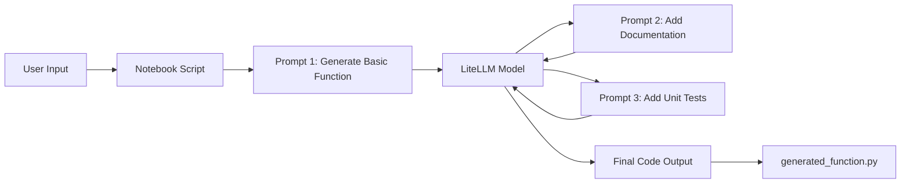

# Project Walkthrough: Iterative Python Code Generator Using LiteLLM

[Jump to QuasiAgent Workflow Diagram](#quasiagent-workflow-diagram) | [Jump to QuasiAgent Implementation Code](#quasiagent-implementation-code)

## Overview

This document details a multi-turn conversational pipeline developed in Python using the `litellm` library. Instead of generating a perfect script in one single attempt, this program relies on **Iterative Prompting (Chain of Thought)**, guiding the LLM through three consecutive stages: function creation, detailed documentation, and robust unit testing.

This README can also include other notebook files for different agent implementations.

## QuasiAgent Workflow Diagram

Here is the end-to-end architecture flow detailing how the data passes between your user input, the notebook script, and the LLM brain:

Source link: [Gemini share](https://gemini.google.com/share/afb54c01d410)



---

## QuasiAgent Implementation Code

Below is the full implementation script ready to be executed in a standard Jupyter Notebook environment or Google Colab:

````python
import os
import re
from typing import List, Dict
from litellm import completion

# 1. Setup Helper Functions
def call_llm(messages: List[Dict]) -> str:
	"""Helper to handle the LiteLLM API call."""
	response = completion(
		model="openai/gpt-4o",
		messages=messages,
		temperature=0.2
	)
	return response.choices[0].message.content

def extract_code(text: str) -> str:
	"""Extracts raw python code blocks from markdown text."""
	code_blocks = re.findall(r"```python\s*(.*?)\s*```", text, re.DOTALL)
	if code_blocks:
		return code_blocks[0].strip()
	code_blocks = re.findall(r"```\s*(.*?)\s*```", text, re.DOTALL)
	if code_blocks:
		return code_blocks[0].strip()
	return text.strip()

# Initialize our chat history
messages = [
	{"role": "system", "content": "You are an expert Python developer. Only return code inside standard markdown python code blocks."}
]

# Get the initial idea from the user
user_idea = input("What function would you like to create? ")

# --- PROMPT 1: Generate Basic Function ---
print("\n--- Step 1: Generating Basic Function ---")
messages.append({"role": "user", "content": f"Write a basic Python function for the following requirement: {user_idea}"})

raw_response_1 = call_llm(messages)
messages.append({"role": "assistant", "content": raw_response_1})

extracted_code_1 = extract_code(raw_response_1)
print("\n[Extracted Base Code]:\n", extracted_code_1)

# --- PROMPT 2: Add Comprehensive Documentation ---
print("\n--- Step 2: Adding Comprehensive Documentation ---")
doc_prompt = (
	"Take the code we just generated and add comprehensive documentation. "
	"Include a detailed docstring containing:\n"
	"- Function description\n"
	"- Parameter descriptions\n"
	"- Return value description\n"
	"- Example usage\n"
	"- Edge cases handled"
)
messages.append({"role": "user", "content": doc_prompt})

raw_response_2 = call_llm(messages)
messages.append({"role": "assistant", "content": raw_response_2})

extracted_code_2 = extract_code(raw_response_2)
print("\n[Extracted Documented Code]:\n", extracted_code_2)

# --- PROMPT 3: Add Unit Tests ---
print("\n--- Step 3: Adding Unittest Framework ---")
test_prompt = (
	"Take the documented code we just created and add unit tests using Python's standard `unittest` framework. "
	"Append the tests to the bottom of the file. Ensure the tests cover:\n"
	"- Basic functionality\n"
	"- Edge cases\n"
	"- Error cases\n"
	"- Various input scenarios\n"
	"Make sure to include the standard `if __name__ == '__main__': unittest.main()` block at the very end."
)
messages.append({"role": "user", "content": test_prompt})

raw_response_3 = call_llm(messages)

final_code = extract_code(raw_response_3)
print("\n[Final Code with Tests]:\n", final_code)

# --- Save to File ---
filename = "generated_function.py"
with open(filename, "w", encoding="utf-8") as f:
	f.write(final_code)

print(f"\n[Success] Process complete. Saved to {filename}")
````
